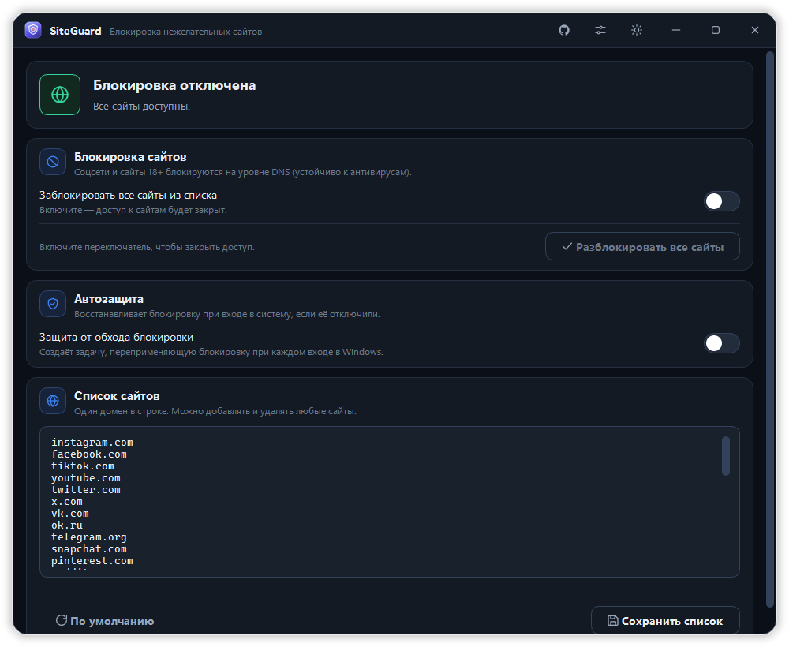
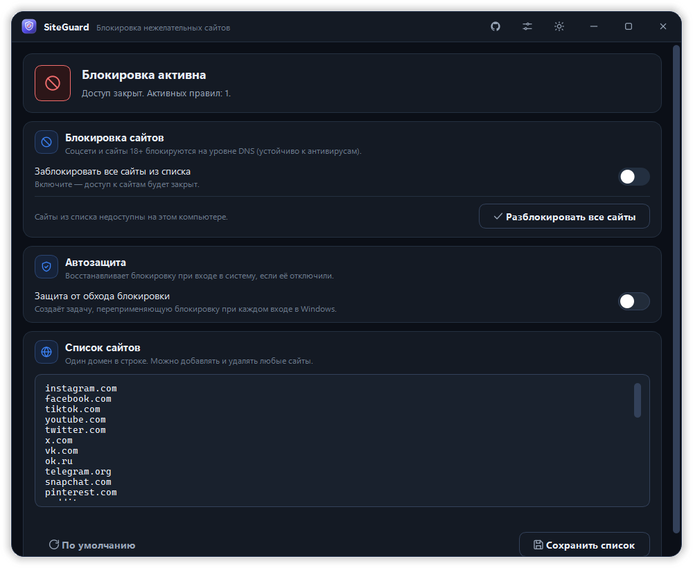
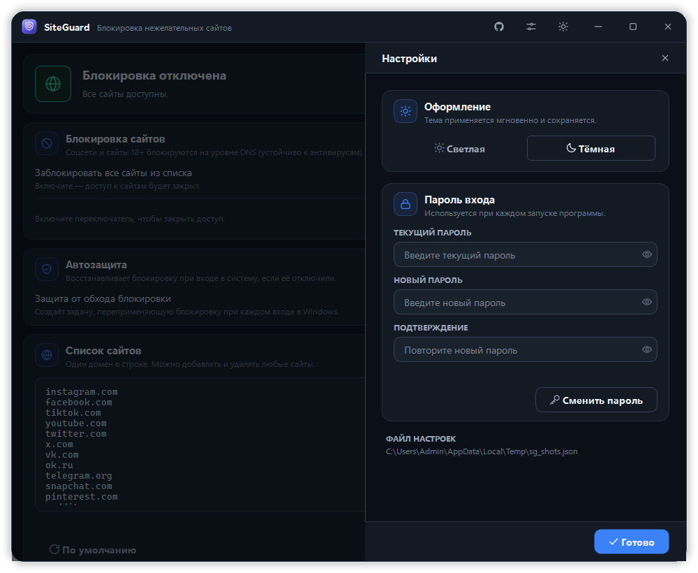
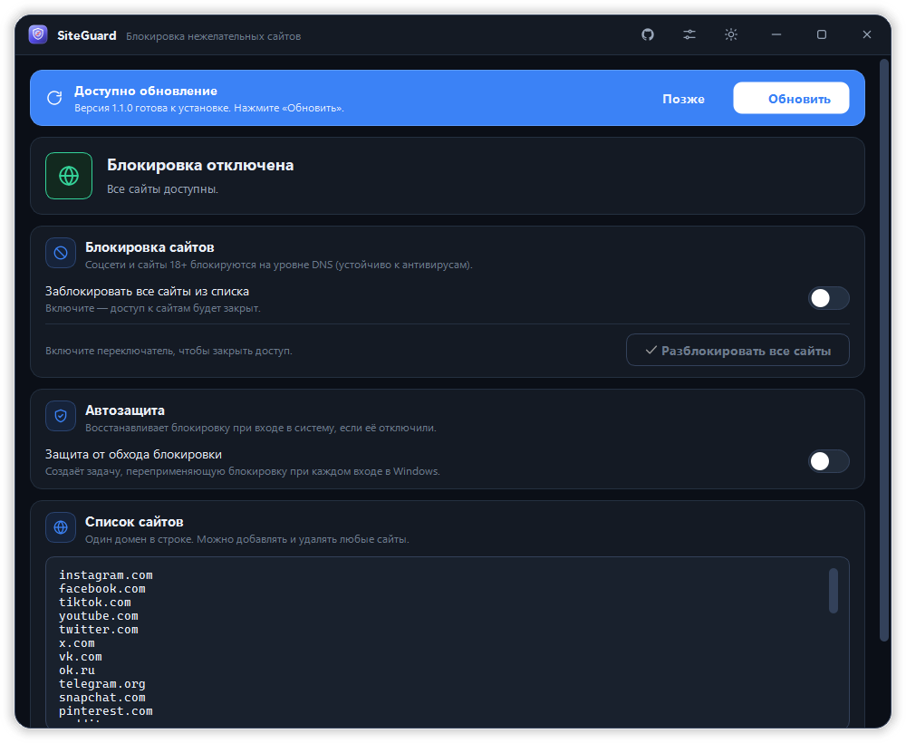
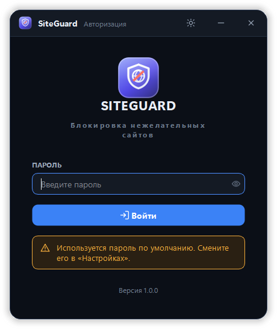
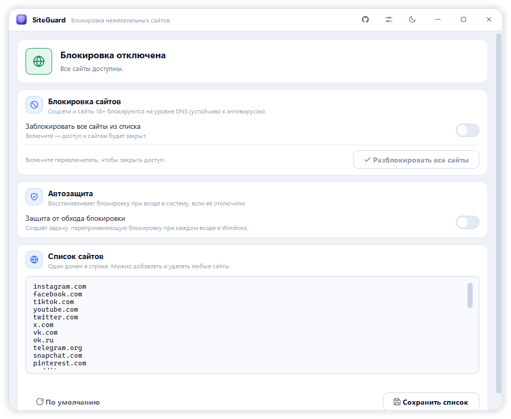

# SiteGuard

**Блокировка нежелательных сайтов для Windows**

Соцсети и сайты 18+ становятся недоступны на уровне DNS — надёжно, на весь компьютер и устойчиво к антивирусам.

---

## О программе

**SiteGuard** — современное настольное приложение для родительского контроля и наведения порядка на рабочих станциях. Одним переключателем закрывает доступ к соцсетям и сайтам для взрослых, защищает настройку от обхода и обновляется автоматически.

Блокировка работает через **NRPT (Name Resolution Policy Table)** — штатную политику разрешения имён Windows. Это принципиально надёжнее, чем правка файла `hosts`, который антивирусы (Kaspersky и др.) отслеживают и откатывают. Политика DNS действует для **всех** браузеров и приложений сразу.

## Скриншоты

| Главное окно | Блокировка активна |
|:---:|:---:|
|  |  |

| Настройки | Автообновление |
|:---:|:---:|
|  |  |

| Вход по паролю | Светлая тема |
|:---:|:---:|
|  |  |

## Возможности

- **Блокировка одним переключателем** — закрывает доступ ко всем сайтам из списка.
- **Кнопка разблокировки** — становится активной, когда блокировка включена, и мгновенно восстанавливает доступ.
- **Готовый список** — популярные соцсети (Instagram, Facebook, TikTok, YouTube, Twitter/X, VK, Telegram и др.) и сайты 18+.
- **Редактор списка** — добавляйте и удаляйте любые домены вручную, один домен в строке.
- **Автозащита от обхода** — задача Windows восстанавливает блокировку при каждом входе в систему, если её отключили.
- **Защита паролем** — вход в программу закрыт паролем; изменить список или снять блокировку без него нельзя.
- **Автообновление** — при выходе новой версии приложение само предложит обновиться и установит её в один клик.
- **Тёмная и светлая темы**, современный интерфейс, плавные анимации.
- **Автономный EXE** — один файл, никаких зависимостей и установки.

## Установка

1. Скачайте **[SiteGuard.exe](https://github.com/imomzoda-dev/SiteGuard/releases/latest)** из последнего релиза.
2. Запустите файл — программа запросит права администратора (они нужны для изменения политики DNS).
3. Войдите по паролю. **Пароль по умолчанию:** `q1w2e3r4` — смените его в разделе «Настройки».

## Как пользоваться

1. При необходимости отредактируйте список сайтов в карточке **«Список сайтов»** и нажмите «Сохранить список».
2. Включите переключатель **«Заблокировать все сайты из списка»** — доступ будет закрыт.
3. Чтобы вернуть доступ — нажмите **«Разблокировать все сайты»**.
4. Включите **«Автозащиту»**, чтобы блокировка восстанавливалась после перезагрузки.

## Автообновление

SiteGuard периодически проверяет [релизы на GitHub](https://github.com/imomzoda-dev/SiteGuard/releases). Когда доступна новая версия, вверху окна появляется кнопка **«Обновить»** — по нажатию приложение скачивает новую версию, заменяет себя и перезапускается. Ручных действий не требуется.

## Требования

- Windows 10 или Windows 11;
- права администратора (запрашиваются автоматически).

## Отказ от ответственности

SiteGuard предназначен для родительского контроля и администрирования **собственных** компьютеров и рабочих станций. Используйте программу только на устройствах, которыми вы вправе управлять.

## Автор

Разработчик — [**@imomzoda-dev**](https://github.com/imomzoda-dev).

---

Сделано с ❤️ на Python и PySide6 (Qt for Python).

